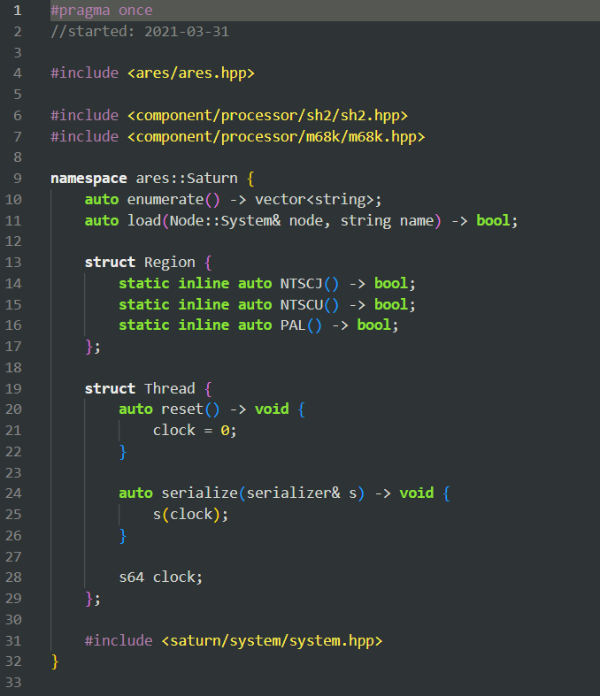

# Oblivion GEdit Color Scheme for VS Code

A VS Code color theme inspired by the Oblivion color scheme in GEdit.

> The code pictured is from [Ares](https://ares-emu.net/); an up-to-date copy is available [here](https://github.com/ares-emulator/ares/blob/master/ares/saturn/system/system.cpp).

## Prior Art

I wrote this extension before I learned of [the Oblivion++ VS Code theme](https://github.com/LoveGlitchCoffee/Oblivion-plus-plus). You might want to use that instead.

## Installation

I have not published this theme to the VS Code marketplace. To install, you can [package it yourself](https://code.visualstudio.com/api/working-with-extensions/publishing-extension#vsce) and run `code --install-extension <path>.vsix` on the VSIX package, or create a subdirectory in `~/.vscode/extensions/` containing the `package.json` file and `themes/` directory provided here.

## Motivation

I discovered this theme from Near, who would upload screenshots of *bsnes*/Higan/Ares source code with it. I liked the vibrant green accents. I initially thought it was a custom color scheme, but I'm now certain it is GEdit's Oblivion.
